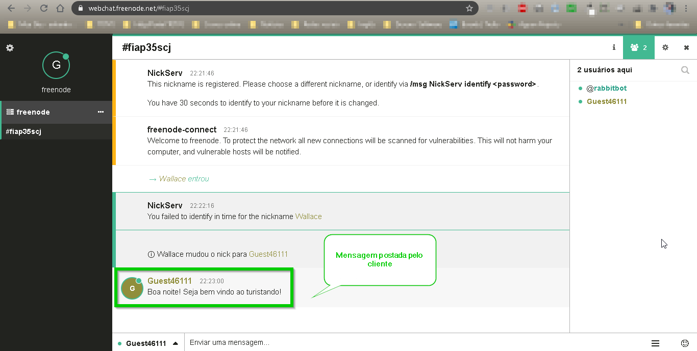
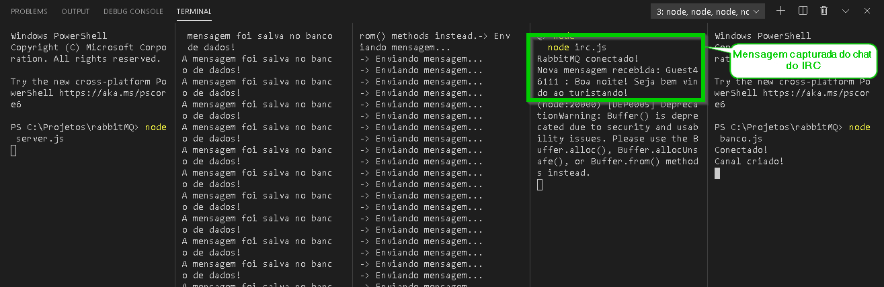
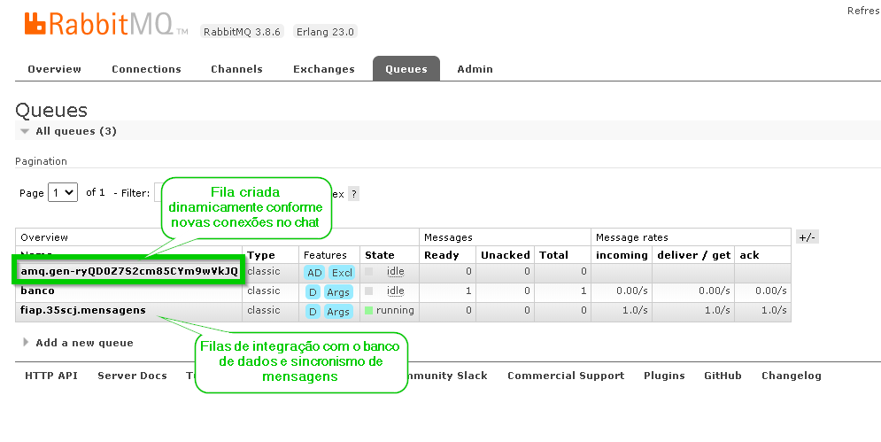
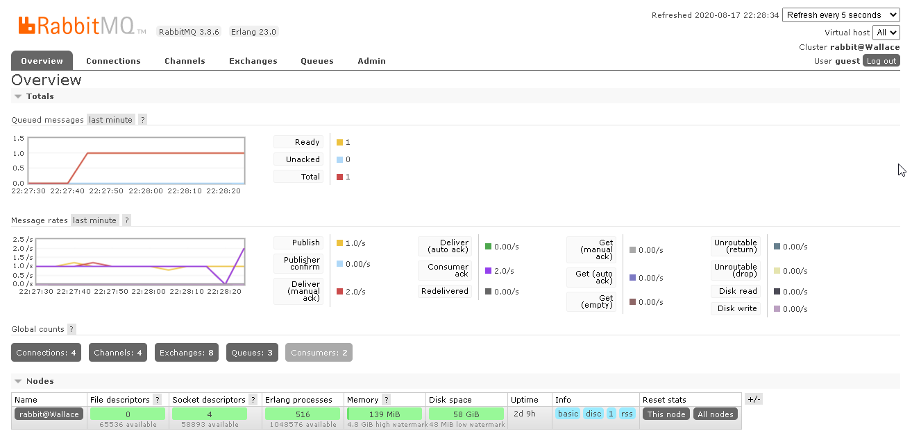

# rabbitMQ
Este projeto tem com objetivo atender a arquitetura de mensageria do projeto Startup One da FIAP. 

Integração do webchat IRC com o RabbitMQ

Requisitos:
1) Node instalado
2) RabbitMQ instalado

Instruções:
1) A portal 8080 deve estar liberada;
2) Acessar o portal IRC pelo link https://webchat.freenode.net/#fiap35scj para interagir no canal;
3) Iniciar os serviços principais do projeto para execução local:
    ```   
    consumer.js
    irc.js
    producer.js
    server.js
    banco.js
    ```

<ul>
    <li>Cliente interagindo no canal</li>
</ul>



<ul>
    <li>Processos executando em backgroud e consumindo mensagens do WebChat</li>
</ul>



<ul>
    <li>Filas criadas dinamicamente no RabbitMQ conforme conexões existentes</li>
</ul>



<ul>
    <li>Painel do RabbitMQ com o overview das conexões e mensagens processadas</li>
</ul>

